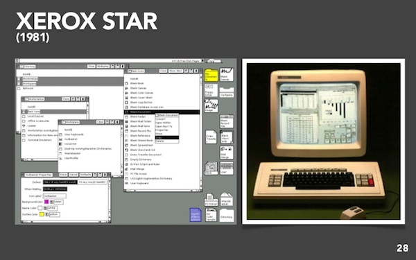
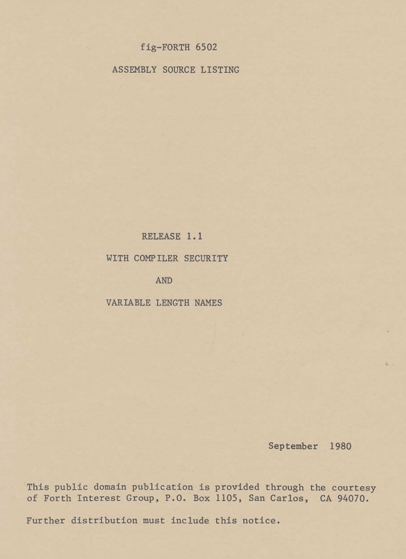

State of the Art Software Development in 1982

The first version of this game was started shortly after I bought my first home computer, an Atari 800 with 48KB of Ram and one Atari 810 Disk Drive.  At this time I was working at Xerox Systems Development Department on the [Xerox Star System](https://en.wikipedia.org/wiki/Xerox_Star) which the marketing geniuses at Xerox called the Xerox 8010 Information System.  Since I was working full time I programmed Sumo Worms (My original name for the game) in the evenings and on weekends. I was very aware of the fact that some technology companies had tried to claim ownership of code written by employees on their own time.  As a result I was very careful to do all the game work not only on my own time, but also on my own equipment. In the end I actually formally requested a release from Xerox for the game. Eventaully I got an official letter from the lawyers at Xerox Corporate Office in Rochester NY acknowledging the fact that Xerox had no interest in bringing this to market. One of my great regrets is the fact that I didn't keep a copy of this letter.
So what was software development like in 1982? At Xerox it was pretty fabulous! High level language - [Mesa](https://en.wikipedia.org/wiki/Mesa_(programming_language)), built-in 10MB hard drive, multiple local area ethernet networks connected via the ARPANET, network file system, Laser printers, a 1024×809 monochrome bitmapped display, an IDE with built in debugger.  Xerox designed the hardware, the network protocols, and the Mesa language and implemented the compiler and the associated micro-code which enabled the [Amd 2900](https://en.wikipedia.org/wiki/AMD_Am2900) [bit-slice processors](https://en.wikipedia.org/wiki/Bit_slicing) to execute the Mesa Language via a set of well defined byte codes [Mesa Princops](http://www.woodward.org/mps/). Here is an example of how wonderful the software development system was (and a example of how a closed system can react faster than an open system).  The most frequently occuring Mesa op-codes were assigned 8-bit op codes in the virtual machne and less frequently used opcodes used 16-bit instructions.  One weekend the Mesa group, about 5 brilliant engineers,  analysed the then current code base for the entire Star system.  This was the entire output of about 100 ~ 150 engineers over about two ~ three years of effort. They discovered that some 16 bit opcodes were actually more common than some 8-bit opcodes in the aplication overall.  So they rearranged the opcode definitions, update the mesa compilers, and issued new micro-code for the machines.  On Monday morning 200 engineers in Palo Alto and El Segundo all had 20% smaller compiled program sizes and zero source code-changes and zero new bugs introduced.  This was in 1982!  One of the reasons I have read for the failure of Xerox Star, was the development environment was so wonderful that it enabled the engineers and designers to build a system that was 10 years ahead of its time.  I think there is a lot of truth to this.
## Indie Software Development in 1982

At home however was a totally different story! An [Atari 800](https://en.wikipedia.org/wiki/Atari_8-bit_family), with a 1.79 MHZ 6502 8 bit processor with 48KB RAM - ($1500) + an Atari 810, a 90KB single sided single density disk drive ($500), a 300 baud acoustic modem connected through an external [serial port adapter](http://www.atarimania.com/faq-atari-400-800-xl-xe-what-is-the-atari-850-interface-module_52.html) . No mouse, no disk operating system, no file system. The system was primitive, but it was **MINE**.  For the first time, I, as a software artist, did not need a patron to provide me a computer to play on. It was revolutionary! It was in fact the beginning of the home computer revloution for me.

How should I program the Atari 800?  Basic was out of the question both for performance and memory cosiderations.  The high level languages at Xerox had spoiled me enough that I was reluctant to program totally is 6502 Assembler (I know, I'm a wimp). There was no C compiler for the Atari, what to do?  Well, I was saved by an astronomer, and Bill Ragsdale and the birth of the open source movement.  The astronomer was [Charles Moore](https://en.wikipedia.org/wiki/Charles_H._Moore) who invented the [FORTH](https://en.wikipedia.org/wiki/Forth_(programming_language)) language in 1968. Forth is a threaded, interpreted, extensible language with remarkable compactness. The next hero in my story is Bill Ragsdale.  I claim Bill Ragsdale started the open source software movement (three years before Richard Stallment started the Free Software Movement) by [publishing his implementation](http://www.forth.org/fig-forth/fig-forth_6502.pdf) of Forth form the 6502  called fig-Forth in 1980.

I got my copy of this document at a [home brew computer club meeting](https://en.wikipedia.org/wiki/Homebrew_Computer_Club) in Menlo Park, CA where I lived.  Menl Park was also the birthplace of the Arpa Net and home to the [People's Computer Center](https://en.wikipedia.org/wiki/People%27s_Computer_Company) an early community computer center that published a Tiny Basic. he first version was published by the People's Computer Company in a separate newsletter format known as the "Tiny BASIC Journal", or in its full name, "Dr. Dobb's Tiny BASIC Journal: Calisthenics & Orthodontia, Running Light Without Overbyte" it eventually became known simply as Dr. Dobb's Journal. Is it a coincidence that all of these groups, including Doug Engelbart's [Augmentation Research Center](https://en.wikipedia.org/wiki/Augmentation_Research_Center) which created [The Mother of All Demos](https://en.wikipedia.org/wiki/The_Mother_of_All_Demos) were headquartered in Menlo Park, CA, a city with a population less than 30,000 in 1982?

A fig-forth disk for the Atari 800 and [Chris Crawford's](https://en.wikipedia.org/wiki/Chris_Crawford_(game_designer)) invaluable [De Rey Atari](https://www.atariarchives.org/dere/) book which explained how the Atari Hardware worked were engough to get me started.

The fig-Forth system included, a compiler, an assembler, and editor, and a disk file system in under 16KB of memory. Most of it was written in Forth itself.  For example, a complete [6502 assembler](https://atariwiki.org/wiki/Wiki.jsp?page=6502%20Assembler%20in%20Forth) was implemented in 96 lines of Forth (also by Bill Ragsdale).  Forth is also an extensible language, meaning new keywords can be added to the language at compile time! This feature is very powerful, but also makes its possible (almost irrestible) for each programmer to create their own dialect in for a given problem domain.  This makes Forth better suited to Software Artists (single programmer projects) than to Software Engineers (team projects).  This feature also gives Forth a reputation as a write only language (it is difficult to read another's code).  Developing Worms? using a 1.79 MHz 8-bit 6502 cpu and 90kb, slow floppy drives was painful. But it was possible! I think it took about 30 minutes for a full build, swapping source disks and then writing a bootable disk.

When I had a more less completed version of Sumo Worms in the fall of 1982, I started looking for a publisher.  Several comanies, including Epyx politely declined. Electronic Arts was just getting organized, and had hired its first VP of Software development, Tim Mott, from Xerox.  Electronic rts offered to publish the game (including a $15K advance against royalties).  They simultaneously offered me a job as a software engineer.   I accepted both.  Thus Steve Hayes and I, both from Xerox SDD became the first two engineers hired by Electronic Arts.  I was employee number 11.  When I had completed the software EA had me deliver it via file transfer (over a 300 baud acoustic modem) because of some obscure tax code concerning tangible goods.  If the goods were delivered by modem, they couldn't possibly be considered tangible!  I actually still have this "Golden Master" floppy.

This was back in the day when you had to get the software correct **BEFORE** you shipped it.
So game development was possible for an indivdual software artist in 1982.  However marketing, publishing and distributing software was all but impossible for an individual.  So one needed a publisher.  I was very lucky that Electronic Arts published my game. I have long suspected that their desire to hire me played a large role in their decision.

## Indie Software Development Today

Darworms is implemented as a single page application. It is written in a modern version of JavaScript called ECMA Script 6 or simply ES6.  It uses an application framework called [JQuery Mobile](https://jquerymobile.com/) which is built on top of [JQuery](https://jquery.com/).
I developed Darworms using my 15" MacBook Pro with 16MB of RAM. I stated out using Webstorm as an IDE but switched to [Atom](https://atom.io). [Github](https://github.com/dmaynard/Darworms) is used for source control. Deployment to darworms.com and serving darworms.com is done by [Netlify](https:netlify.com) which is amazing and wonderful.
Today the independent game developer has an embarressment of riches at her disposal.  For about the price of my Atari 800 with extra memory and disk drives I now have a 15" MacBook Pro, with a 5,000 times faster CPU, and with over 300,000 times more RAM. The amount of information I have immediate access to is has grown at an even faster rate with the development of the internet.  However the complexity of the systems has almost kept pace.  In 1982 my entire development environment was 250 KB (three floppies).  Today my Darworms project directory alone is about 100 MB or 400 time larger. Here are the technologies I had to learn to complete the game in
### 1982:
* Atari Hardware Architecture
* 6502 assembly
* Forth language
* Forth Editor

### 2019
* Javascript
* ES 6
* HTML 5
* CSS
* SVG (Canvas Graphics)
* JQuery
* JQuery mobile
* JQuery Mobile Theme Roller
* Ajax
* Web Audio
* Babel
* Roll-up
* Node
* NPM
* NVM
* GitHub
* Netlify
* Atom
* Chrome Developer Tools
* Google Analytics

Here are some comparison metrics between creation of roughly the same game in 1982 and also in 2019:

Item |    1982   |   2019
-----------|-------------|-------------
Platform | Atari 800 | Modern Web Browsers
Dev CPU   | 1.79 MHz | 2.5 GHz (x4 Cores)
Dev RAM  | 48 KB  |  16 GB
Dev Stsem Cost  |  $2,500 |  $2,500
Language | Forth | ES6
Source Code  |  120 KB | 164 KB
Run Time Code  | 32 KB  |  534 KB
Run Time Resources  |  4 KB |  1.6 MB (Audio Samples)
Build Time  |  20 Minutes |  1.1 seconds
Channel  | Retail  |  Single Page Web Application
Deployment Time  | ~ 6 weeks  |  ~ 6 minutes
Cost   | $45 US   |  Free (darworms.com)
Platform Installed Base|2 Million  |~ Billions
Publisher | Electronic Arts | Self Published
Marketing Media  |  Print Ads |  ? Facebook?
Marketing Budget | $50K (1) |  ~ $0
Units (sold or downloades)  | ~ 15,000  | **?**
Total Author Revenue  |  $15,000 US |  **?**

(1)  This is a % of the EA launch ad budget as Worms? was a Launch Title for EA
