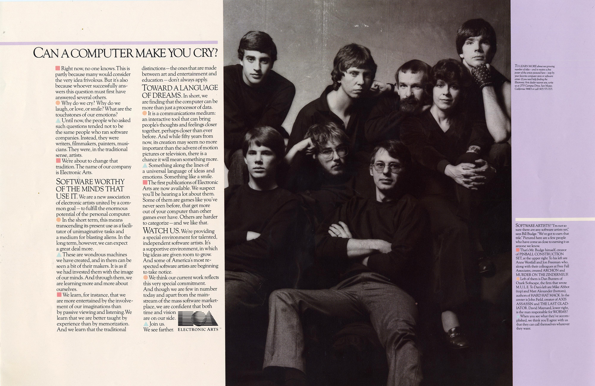

### What is a Software Artist?
 1. An artist, or small group, that uses software as a medium.
 2. [Trip Hawkins's 'big idea' that launched Electronic Arts](https://www.youtube.com/watch?v=b89-7msvlac target="_blank")
 3. The brilliant marketing campaign by Trip Hawkins, Bing Gordan and Richard Melmon at Electronic Arts in 1983 and brilliantly executed by Jeff Goodby and Andy Berlin as Goody Berlin and Silverstein's first [ad campaign](https://www.eurogamer.net/articles/2018-09-16-seeing-farther-the-advert-that-changed-the-games-industry) in 1983.
 3. A software engineer that works as an individual, or on a small team, and strives to ship, but not maintain a program (a work).
 4. A programmer without a paycheck.

I have been all of the above times in my career.  In 1982 I met definitions 1 -3.  I was moonlighting, writing a game for the Atari 800, while working at Xerox PARC.  It was the first time I could afford to buy a computer, and therefore I did not require patron to provide a computer.  This freed me to program something I wanted to see, rather than something my company wanted to sell. It freed me to explore what home computers were capable of.  I was incredibly lucky in that as I was looking for a publisher of my (very abstract) game Electronic Arts was just ramping up.  Trip had hired Tom Mott from Xerox to be the first VP of Engineering at Electronic Arts.   So I pitched the game to EA and we signed an publishing agreement.  They also offered me a job which I quickly accepted based on Trip's vision for the home computer.  I have always suspected that their agreement to publish my game was greatly influenced by their desire to hire me as an engineer.  By this lucky coincidence I became a "Software Artist" and got my fifteen minutes of fame through the Electronic Arts launch campaign. Which included this photo by world famous rock star photographer [Norman Seef](http://normanseeff.com/).

My time as a Software Artist was even shorter lived than my fifteen minutes of fame however. As soon as I signed the employment agreement with Electronic Arts I was no longer an artist, but an employee with tasks, management and schedules. One of the lesser known reasons for Electronic Arts success is that from the beginning they hired both computer scientists, and self-trained computer savants.  Talented computer scientists from Xerox also included Steve Hayes, Jerry Morrison, and Dan Silva. This allowed Electronic Arts to become a "value added" publisher which enabled independent software artist access to tools and processes developed internally.  My position as a technical director at Electronic Arts allowed me to work closely with some of the most talented Software Artists that helped launch the home computer entertainment market.  Daniel Berry Bunten and Ozark Softscape - [M.U.L.E.](https://www.filfre.net/2013/02/dan-bunten-and-m-u-l-e/) Seven Cities of Gold, Modem Wars. Eddie Dombrower - Earl Weaver Baseball. Ray Tobey - Skyfox, Bill Budge - [Pinball Construction Set](https://www.filfre.net/tag/pinball-construction-set/) and many others.

What is the difference between a software engineer and a software artist?  I define a "Software Artist" as an artist that uses software to create a work of art.  How is this any different than a Software Engineer?  The artist owns the project, and does all, or almost all, of the coding of the work.  The artist owns the all design decisions, the definition of the work, and the schedule.  The engineer typically works on a team implementing a project with a specification, schedules, and some form of project management.   The artist completes the work and publishes it.  The artist does not plan on modifying the published work. The engineer probably spends more time on modifying and maintaining the project than on it's creation.  Documentation and code readability are vital to an engineering team.  Continuous deployment with automated testing is the goal of the modern engineering team. The goal of the artist is to complete the work, to "put it in the can".  I plan to write about some of these amazing software artists that I got to work with at Electronic Arts.  On rare occasions I have also worked with software artists in corporate environments.  These were exceptional engineers that saw a need for a program and single handedly, usually without management's prior approval or knowledge implemented the program.  Examples are Dan Silva who did [Deluxe Paint[(https://en.wikipedia.org/wiki/Deluxe_Paint)] at Electronic Arts, and Bill Duvall who implemented the code edit features of Doug Engelbart's NLS system on the Alto computer at Xerox P.A.R.C.  Duvall's work also had the best name of any software product I have ever encountered. It was called ugh, which stood for "Uncommonly Good Hack". And it was! In fact it was a better code editor (in 1981) than I can find today! It used a mouse and [keyset](http://www.dougengelbart.org/content/view/273/309/) and structured editing.

In this blog I want reminisce about some of the remarkable software artists, and software engineers I have had the pleasure of working with in my career. [My first blog in this series is a tribute to Jim Nitchals](/artist-tribute-jim-nitchals/)
