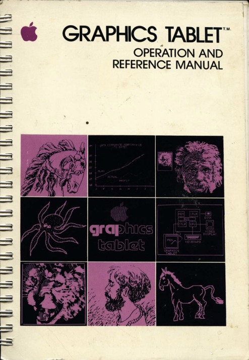
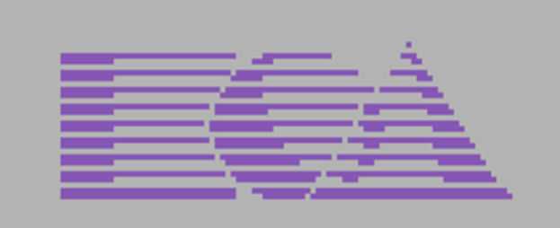

In this blog I want reminisce about some of the remarkable software artists, and software engineers I have had the pleasure of working with in my career.  In this first of a series I am going to highlight [Jim Nitchals](http://www.gamedesignersremembered.com/jim-nitchals/category/all), a brilliant, self-taught Apple II guru.  Tragically Jim died of a massive brain hemorrhage in 1998 at the age of 36.  R.I.P. Jim.

The link above is a nice Tribute to and Bio of Jim.  It covers his time before I knew him at Electronic Arts, and his time after Electronics Art as pioneering spam fighter.  However it does not cover his time at Electronic Arts where I got to know him well.  I will begin with a typical "Nitchals Story", of which there are many.
It was after midnight in the offices of Electronic Arts on Campus Drive in San Mateo.  The only two people in the building were Ray Tobey, an 18 year old Apple II prodigy, and software artist, working on his game Skyfox.
 
 Ray working on the art for Skyfox using one of the original Apple II graphics tablets.  Jim came into the room where Ray was working and listening to the radio.  Watching Ray work Jim noticed that every time Ray pressed the stylus onto the graphics tablet there was a click of static on the radio.  Jim didn't say anything about the static click, he just asked Ray if he had a manual for the tablet.  Ray had this manual which he handed to Jim who then left the room.   About an hour later Jim comes back into the development bullpen with a floppy disk.  He hand the disk to Ray and says, here boot this disk.   So Ray put it into the Apple II disk Drive and rebooted the Apple II.  To Ray's astonishment as soon as the disk booted, the radio started playing the Stars Bangled Banner! This amazing feat makes some sense when you realize that Jim is credited with the first in-game music on an Apple II with his [Microwave]("https://www.youtube.com/watch?v=8EXWxgmym0E) game.  The Apple II had no dedicated sound hardware. The only  means of controlling the audio was to write or read location 0xC030 which inverted the position (in/out) of the speaker cone. Repeatedly hitting this location at the correct times would produce a square wave.  Jim knew the cycle time of every 6502 instruction and interspersed speaker toggles in all the game loops that generated in game music inMicrowave.  I personally watched Jim write long routines in HEX without even the aide of an assembler.
 I can think of at least two instances where Jim's code literally save Electronic Arts.  The first was Jim's **Fat Track Loader**. This code was the "Copy Protection" for Electronic Arts C64 disk products.  The manufactured disks had a double wide, "fat track", written by special hardware at the disk duplication which was impossible to duplicate on consumer hardware.  However the code to check this signature and load the game was shipped on every disk. Jim's Fat Track Loader was so clever, so diabolical, and so obtuse that it was over a decade before a full explanation of how it worked was [published](https://c64preservation.com/files/EaLoader.txt).
  If any of you hackers out there spent far too many hours cursing at this screen, here is the reason why.  These are some notes from that explanation:
 ***
 Electronic Arts C64 Fat Track loader

This one is a monster… even more so when you take a look at the possibilities for games to check if they were loaded by the proper, unmodified loader.
It's pretty much all here: self-modifying code, P-code, encryption, checksumming, memory fills, everything.

The decryption routine uses multiple checksums of the loader code to come up with the decryption key.
Finally, memory from $0800 to $7EFF is decrypted.
Then a checksum is run over the resulting code, and compared to a value in the header.
If it is good, then the game's start address is decrypted and the game is started up.

Now, where is all of this decryption and fat track code hidden?
Inside a P-code interpreter.  The loader interleaves 6502 code with P-code, making it difficult to get a dump of either. Then a checksum is run over the resulting code, and compared to a value in the header.  If it is good, then the game's start address is decrypted and the game is started up.  The more sensitive the game is to the exact state of the machine at this point, the harder it is going to be to save off the game.  I/O registers are subtly tampered with.  Key values are written under the kernel.  Altering a single bit of memory in certain places causes decryption operations to go wildly awry.
***
Electronic Arts was essentially a struggling start up for the it's first six years.  The effectiveness of Jim's Fat Track Loader absolutely helped prevent loss of sales to software piracy and thus helped to Electronic Arts to survive.   Electronic Arts really started making money after it started making cartridges for the Sega Genesis machine in 1990.  Electronic Arts used a "clean-room" approach to reverse engineer the Sega Genesis machine which allowed EA to make a sweetheart publishing deal with Sega.  EA was the only publisher which was allowed to manufacture its own cartridges.  Jim played a vital, even key, role in this reverse engineering project.  What was remarkable was that Jim was on the "Clean Team" for this project.  The notion behind a clean room project is one team is "dirty" and examines the ROM hardware and disassembles system code. The dirty team then writes an English language version of this description of the machine and gives it to a legal team.  The legal team gives the English language description to the clean team and they then implement software for the machine.  IBM had recently won lost lawsuit against  Compaq Computers who they claimed had illegally reversed engineered the IBM BIOS Software.  Compaq had used a well documented clean room approach and won the case.  It was Trip Hawkin's brilliant plan to reverse engineer a Sega Genesis.  Then when Trip went to negotiate with Sega about a publishing license on Genesis platform he asked for what must have seemed like outrageous terms to SEGA.  They said no way.  Trip then threatened to publish on the platform without a license from SEGA.  They said that was impossible because Electronic Arts had never obtained a development nor development documentation from SEGA.   Trip said "Wanna bet?" and pulled a cartridge from his brief case, plugged it into a Genesis on the table and demoed an EA game.  He then explained how EA had used a clean room approach to reverse engineer the hardware.   This is called negotiating leverage.  SEGA and Electronics signed a publishing agreement that was very beneficial to both parties. The ironic part here is that most of the breakthroughs in the reverse engineering process came via Jim Nitchals experimentation with a consumer unit on the clean team, rather from the dirty team's deconstruction of the SEGA Genesis ROM software.

Jim also ported several existing EA titles to new platforms.  He excelled at this task.  When Jim was tasked with porting Dr. J and Larry Bird Go One-On-One from the Apple II to the IBM PC, Jim had to learn Intel 8086 assembly language and the IBM PC hardware.  Jim was not a fan of higher level operating systems, and in particular he was not a fan of DOS which he felt was bloated.  So he programmed Dr J. using ONLY IBM BIOS calls! He onCreateNode a bootable floppy that booted straight into the game, bypassing DOS all together! If you could find a modern IBM PC with a 5.25 floppy disk this game would still boot and run today!   Jim also did the copy protection loader for this game.  He knew that the standard process of pirates was to observe where the pirated copy of the software failed, and trace backwards from that point to find and disable the disk signature check.  So Jim created a truly diabolical scheme.  When his loader detected a pirated disk, Jim hooked a routine into the IBM's 18.2 hertz timer interrupt.   Every timer tick the routine would very slowly turn down the DMA refresh rate of the hardware. The DMA refresh rate was set to 15.04 microseconds (72 cycles) at boot-up on the original IBM PC. Soon the program would fail with a memory error, but it was totally unpredictable where and when the error would occur making it very difficult to trace execution back from the error.   Of course this crashed the entire machine, but hey, the machine was only running a bootable disk of a pirated game anyway.

Another bit of Nitchals' wisdom was evident whenever someone asked Jim to estimate how long a given project would take.   Jim would say "Show me the development environment". He would then take out stop watch and time the compile-edit-debug loop of an existing project in that environment.  He would multiply that time by 10,000 announcing "All projects take 10,000 builds".  His estimates were more accurate than most.  He also spent a lot of time optimizing the development tools including writing his own in memory cross-assemblers for various platforms.   After he left Electronic Arts Jim became a staunch opponent of spammers, creating the Forum for Responsible and Ethical Email organization.  I, being a recipient of the [world's first spam email](https://www.templetons.com/brad/spamreact.html), greatly appreciated  this work. Jim Nitchals was a genius.  R.I.P. Jim.
