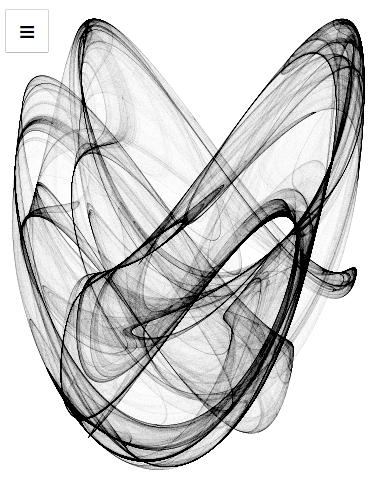

## Pickover's Chaotic Attractor


Here is my latest software art project: An implementation in JavaScript (ES6) of Clifford A. Pickover's classic chaotic attractor. [Try it here](https://chaosvue.netlify.com).  Watch as a beautiful picture, one that no one has ever seen before, fades slowly into view.

The image is generated by computing a histogram of the points visited in the image by continuously iterating a chaotic attractor in the browser's background.

Definition:
```
xn+1 = sin(b*yn) + c sin(b*xn)
yn+1 = sin(a*xn) + d cos(a*yn)
```
where a, b, c, d are variables that define each attractor.
For each new image the four variables are chosen at random. Next the point (x,y) is updated to a new point (xn, yn). This point in the image is made one point darker or lighter on a scale of [0, 255] = [pure black,  pure white]. The pixels are iterated continuously in this manner until 10% of the pixels touched have reached the maximum (or minimum) value.
#### Implementation Notes
I first saw images of Pickovers's chaotic attractor almost 30 years ago when I bought his book [Computers, pattern, chaos, and beauty: Graphics from an unseen world](https://www.amazon.com/s?k=Computers%2C+Pattern%2C+Chaos+and+Beauty+%3A+Graphics+from+an+Unseen+World).
In 1996 I implemented Pickover's chaotic attractor in C++ on an IBM PC to help me learn Windows 95 graphics and application programming. I shared the .exe file with several friends on 3.5" floppy disks. They enjoyed it.
Recently I was looking for a simple project to help me learn the [Vue.js](https:www.vuejs.org) framework and JavaScript bitmap programming. So I decided to implement it once again, this time as a web project using Vue.js. I am really enjoying the Vue.js framework, and the associated development environment. The best part is that now I can share my art project with the masses instead of with just a few friends.  If you enjoy [this art project](https://chaosvue/netlify.com) please help me grow the audience by sharing this link.

If you have questions, or suggestions, or bug reports please don't hesitate to contact me.  The [Source code](https://github.com/dmaynard/chaosvue) can be found on github.
